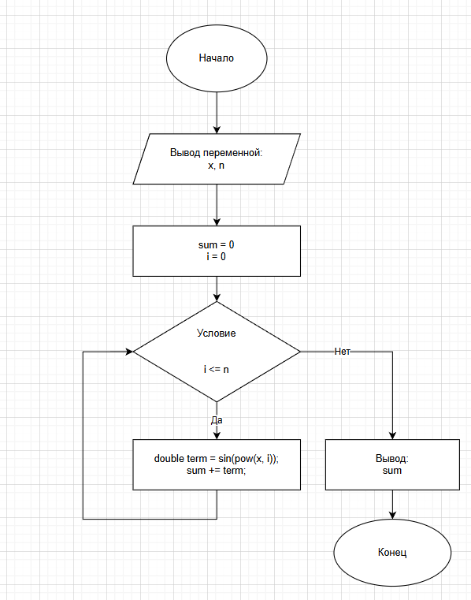

# Лабораторная работа 8: Цикл с параметрами

## 📋 Домашнее задание к работе №8

**Задание:** Вычислите для заданного натурального n и действительного x с использованием цикла for значение:

$$
\sin(x) + \sin(x)^2 + \ldots + \sin(x)^n
$$

## 🧮 Алгоритм работы программы

1. Программа запрашивает у пользователя ввод значения x и максимальной степени n.
2. Инициализирует переменную sum для хранения суммы.
3. Использует цикл for для вычисления каждого члена ряда и добавления его к сумме.
4. Выводит результат на экран.

## 📁 Структура репозитория
Lab8/

├── Task.c   - # Исходный код программы

└── README.md

## 📋 Блок схема


## 📝 Исходный код
```c
#define _CRT_SECURE_NO_WARNINGS
#include <stdio.h>
#include <locale.h>
#include <math.h>

int main() {
    setlocale(LC_CTYPE, "RUS");

    double x;
    double sum = 0.0;
    int n;

    printf("Введите значение x: ");
    scanf("%lf", &x);
    printf("Введите максимальную степень: ");
    scanf("%d", &n);

    for (int i = 0; i <= n; i++) { 
        double term = sin(pow(x, i));
        sum += term;
        printf("sin(x^%d) = %.6f\n", i, term);
    }
    printf("Сумма = %.6f\n", sum);

    return 0;
}
```
## Автор

Чапэ Максим Сергеевич

Группа: бТИИ-251
